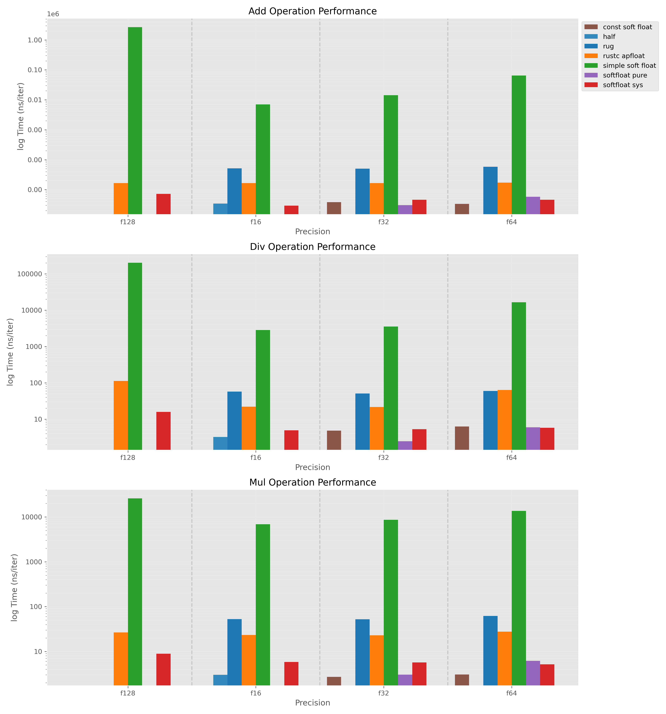

# softfloat_bench
Rust softfloat libarary benchmark

* [softfloat-sys](https://crates.io/crates/softfloat-sys/)
* [simple-soft-float](https://crates.io/crates/simple-soft-float)
* [rug](https://crates.io/crates/rug)
* [rust_apfloat](https://github.com/rust-lang/rustc_apfloat)
* [softfloat-pure](https://github.com/HarryR/softfloat-pure)

